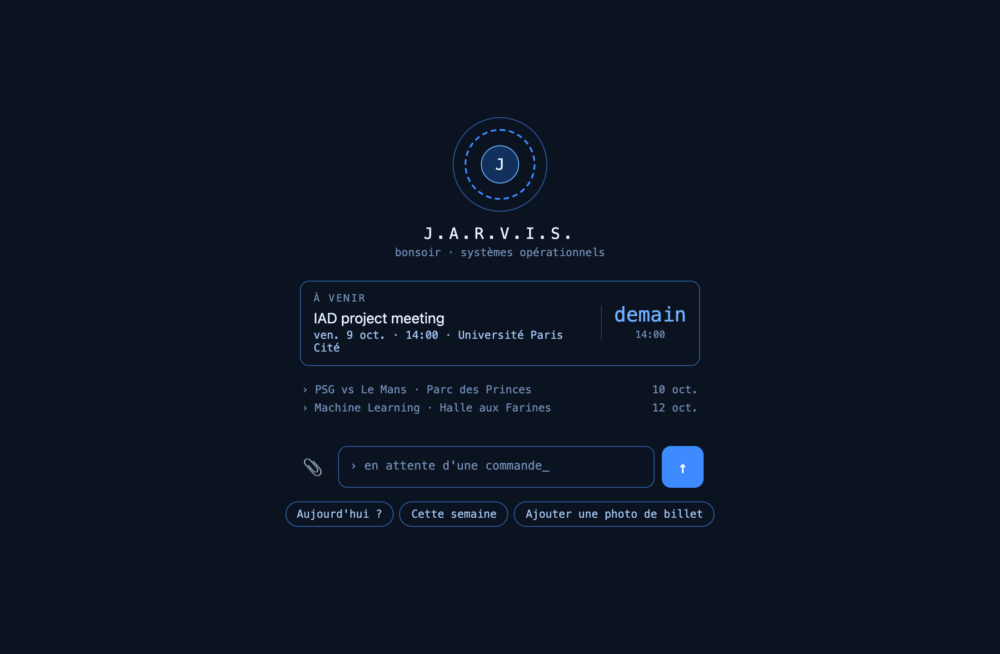
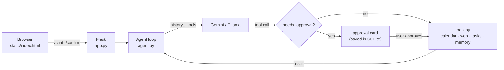

# Jarvis

A personal calendar agent that **acts** on your Google Calendar: it adds events, looks things up on
the web, reads tickets from photos, and **asks for your approval before anything risky**
(deleting, rescheduling, bulk imports). It runs locally as a small Flask app with a
Gemini (cloud) or Ollama (local) model behind it.


*The screenshots use a demo database and fictional events.*

## What it does

- **Talks to your calendar**: "Move Monday's ML class to 3pm", "What's on this week?",
  "Add a 1-hour meeting on Friday at 14:00". Detects conflicts before adding.
- **Finds missing details on the web**: "I have a ticket for J. Cole in Paris, add it": it
  searches, opens the official page to read the actual time, then adds the event.
- **Reads photos**: paste or drop a ticket, poster or invitation; it extracts the date, time and place.
- **Imports a university timetable** (`.ics` export from ADE or similar).
- **Shows its work**: every answer lists the tools it used
  (`› searching the web: "…" ✓`, `› reading page: www.livenation.fr ✓`).
- **Human-in-the-loop approvals**: destructive actions stop and show an approval card.
- **Agenda panel** next to the chat that refreshes after every answer; new or rescheduled
  events briefly glow green.
- **Remembers preferences** ("meetings are 1.5 hours from now on") across conversations.
- **Trilingual UI** (English, French, Turkish, picked from the browser language); the agent
  answers in the language of each message.

<p align="center"></p>

## How it works



1. The user's message is added to the conversation and the model is called with the list of tools.
2. The model either answers, or asks for one or more tool calls.
3. **The app runs the tool calls itself**, appends the results and calls the model again, until it answers.
4. Before running a call, `needs_approval()` checks it. Deleting or updating an event, a bulk
   `.ics` import, or adding despite a conflict **pauses the loop**: the pending call is stored in
   SQLite, the UI shows a card, and the loop resumes only when the user clicks *approve*.

## Design notes

Some decisions that shaped the project:

- **The agent loop is ours, not the SDK's.** Gemini's SDK can run tool calls automatically, but then
  the app can neither show the steps nor stop before a dangerous one. Running the loop by hand
  makes both possible, and lets Gemini and Ollama share the same loop through two small adapters.
- **Safety is enforced in code, not in the prompt.** An earlier version asked the model to "always
  confirm before deleting". Now the check lives in `needs_approval()`: whatever the model says,
  a delete does not run without a click. Approvals survive page reloads; writing a new message
  instead of answering a card counts as a rejection.
- **Token budget.** Only the last N user turns are sent to the model (cut at user messages so a tool
  call is never separated from its result), photos are replaced by a placeholder after the turn
  they were sent in (one conversation went from 491 KB to 12 KB), and saved preferences are
  injected into the system prompt instead of relying on the model to call `recall`.
- **Web search was measured, not guessed.** The search library picks a random engine by default;
  benchmarking each engine on the same queries showed one consistently returning junk and one
  getting 7/8 relevant results every time, so the engine is pinned. Ad links are filtered out.
- **Untrusted content stays data.** Web pages read by `fetch_page` can contain text aimed at the
  model (prompt injection), so tool descriptions tell the model to treat it as information only,
  and the approval gate limits what a misled model can do. Model output is HTML-escaped before
  the small markdown renderer adds tags, so injected `<script>` never runs (XSS).
- **Language-neutral API.** The server sends tool names, codes and ISO dates; all wording lives in
  one `I18N` dictionary in the frontend. Adding a language means adding one block.

## Tools

| Tool | What it does | Approval |
|---|---|---|
| `create_event` | Adds an event, checks conflicts first | only when adding despite a conflict |
| `list_events` | Lists events in a range (used to find IDs) | |
| `update_event` | Changes title, time, place, description | **always** |
| `delete_event` | Deletes an event | **always** |
| `import_ics` | Previews, then imports a `.ics` timetable | **for the import** |
| `web_search` | Searches the web (ads removed) | |
| `fetch_page` | Reads a page's text, optionally around a keyword | |
| `add_task`, `list_tasks`, `complete_task` | A small to-do list in SQLite | |
| `remember`, `recall` | Long-term preferences | |

A new tool is a Python function with type hints and a docstring, decorated with `@tool` in
`tools.py` (plus its JSON schema in `TOOL_SCHEMAS` for Ollama).

## Setup

Requires Python 3.9+ (3.10+ recommended) and a Google account.

**1. Google Calendar access (once)**

1. In the [Google Cloud Console](https://console.cloud.google.com), create a project and enable the **Google Calendar API**.
2. *OAuth consent screen*: choose **External** and add your own address as a test user.
   Then click **Publish app**: in "Testing" mode Google expires the access every 7 days.
3. *Credentials* → *Create credentials* → *OAuth client ID* → **Desktop app**. Download the JSON
   and save it as `credentials.json` in the project folder.

**2. Install and configure**

```bash
git clone https://github.com/BeratMertCibikci/jarvis.git
cd jarvis
pip install -r requirements.txt
cp .env.example .env    # then put your Gemini API key in .env
```

A Gemini API key is free at [aistudio.google.com/apikey](https://aistudio.google.com/apikey).
To run fully locally instead, install [Ollama](https://ollama.com), pull a model that supports tool
calling (e.g. `ollama pull qwen2.5:14b`), `pip install ollama`, and set `ENGINE=ollama` in `.env`.

**3. Run**

```bash
python app.py
```

The browser opens `http://localhost:5001`. On the first calendar request a Google sign-in page
opens; after you allow access, a `token.json` is saved (and renewed automatically if it expires).
Add `?lang=fr`, `?lang=en` or `?lang=tr` to the address to force a UI language.

## Tests

```bash
python tests/test_agent.py
```

Offline tests for the agent loop: a scripted fake model and fake tools exercise both engine
adapters (Gemini and Ollama formats), the approval flow (approve, reject, stale or repeated clicks,
a new message instead of an answer, several tool calls at once) and recovery when the model fails
right after an approved action. No API key or network needed.

## Project structure

```
app.py            Flask endpoints: /chat, /confirm, /history, /events/upcoming
agent.py          agent loop, approval gate, Gemini and Ollama adapters, system prompt
tools.py          the tools, Google Calendar access, approval card details
memory.py         conversation history and pending approvals in SQLite
static/index.html the whole UI: chat, agenda, welcome screen, approval cards, i18n
tests/            offline tests for the agent loop
```

## Limitations

- Single user, runs locally; there's no authentication on the web endpoints.
- Calendar and tools are tied to the user's primary Google Calendar and the Europe/Paris time zone.
- Free search libraries can get rate-limited; a search API (e.g. Brave Search) would be more robust.
- Answers are not streamed; tool steps appear together with the answer.

---

Built by [Berat Mert Cibikci](https://beratmertcibikci.github.io) · M1 Distributed AI, Université Paris Cité ·
[Türkçe README](README.tr.md)
