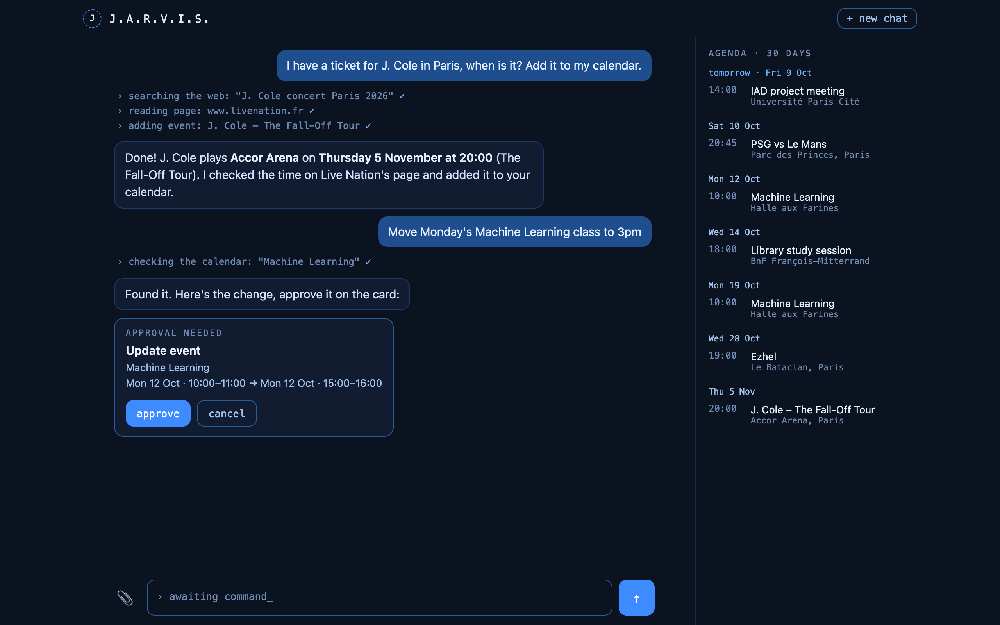

# Jarvis

Google Takvim'in üzerinde **iş yapan** kişisel bir takvim asistanı (agent): etkinlik ekler,
eksik bilgiyi web'de arar, bilet fotoğraflarını okur ve **riskli bir işlemden önce onayını ister**
(silme, saat değiştirme, toplu içe aktarma). Bilgisayarında küçük bir Flask uygulaması olarak
çalışır; arkasında Gemini (bulut) ya da Ollama (yerel) modeli vardır.

İngilizce ve daha ayrıntılı açıklama (mimari, tasarım kararları): [README.md](README.md)



## Özellikler

- Takvimle konuşma: "Pazartesi ML dersini 15:00'e al", "Bu hafta neler var?". Eklemeden önce çakışma kontrolü.
- Web'de arama ve sayfa okuma: "J. Cole konserine biletim var, ekle" → arar, resmi sayfadan saati okur, ekler.
- Fotoğraftan etkinlik: bilet/afiş/davetiye fotoğrafını 📎 ile ekle, Cmd+V ile yapıştır ya da sürükle bırak.
- ADE ders programını (`.ics`) içe aktarma.
- **Araç adımları**: her cevabın üstünde Jarvis'in ne yaptığı görünür (`› web'de arıyor: "…" ✓`).
- **Onay kartları**: silme, güncelleme, `.ics` toplu ekleme ve çakışmaya rağmen ekleme çalışmadan önce
  sohbette kart çıkar. "onayla"ya basmadan çalışmazlar; bu kontrol kodda (`agent.py` → `needs_approval`),
  modelin talimata uymasına bağlı değil. Kartı cevaplamadan yeni mesaj yazarsan işlem yapılmamış sayılır.
- Sohbetin yanında ajanda paneli; yeni eklenen ya da saati değişen etkinlik birkaç saniye yeşil yanar.
- Kalıcı tercihler ("toplantılar bundan sonra 1.5 saat") bütün sohbetlerde geçerli.
- Arayüz Türkçe, Fransızca ya da İngilizce (tarayıcı diline göre; adrese `?lang=tr` ekleyerek de seçilir).
  Jarvis her mesaja o mesajın dilinde cevap verir.

## Kurulum

**1. Google Takvim erişimi (bir kerelik)**

1. [Google Cloud Console](https://console.cloud.google.com) → proje oluştur → **Google Calendar API**'yi etkinleştir.
2. *OAuth consent screen* → **External** → kendi mailini test kullanıcısı olarak ekle. Sonra **Publish app**'e bas:
   "Testing" modunda Google izni her 7 günde bir iptal ediyor.
3. *Credentials* → *OAuth client ID* → **Desktop app** → JSON'u indir, proje klasörüne `credentials.json` adıyla koy.

**2. Kurulum ve ayarlar**

```bash
pip install -r requirements.txt
cp .env.example .env    # sonra .env içine Gemini API anahtarını yaz
```

Gemini anahtarı [aistudio.google.com/apikey](https://aistudio.google.com/apikey) adresinden ücretsiz alınır.

**3. Çalıştırma**

```bash
python app.py
```

Tarayıcı `http://localhost:5001` adresini kendiliğinden açar. İlk takvim isteğinde Google giriş sayfası
açılır; izin verince `token.json` kaydedilir (süresi dolarsa giriş sayfası yeniden kendiliğinden açılır).

## Ollama ile yerel çalıştırma

1. [ollama.com](https://ollama.com) adresinden Ollama'yı kur.
2. Araç çağırmayı (tool calling) destekleyen bir model indir: `ollama pull qwen2.5:14b`
   (36 GB'lık bir M3 Max'te rahat çalışır; daha hızlısı `qwen2.5:7b`, daha güçlüsü `qwen2.5:32b`).
3. `pip install ollama`, sonra `.env` içine `ENGINE=ollama` ve `OLLAMA_MODEL=qwen2.5:14b`.

Not: fotoğraftan etkinlik ekleme, görsel ve araç çağırmayı birlikte destekleyen bir model gerektirir;
çoğu yerel model desteklemiyor. Bu özellik için Gemini önerilir.

## ADE ders programını içe aktarma

1. ADE'den dönem programını `.ics` olarak indir.
2. Sohbette yaz: "Şu dosyadaki dersleri takvime ekle: /Users/.../edt.ics"
3. Jarvis önce kaç ders bulduğunu gösterir, sonra çıkan onay kartında "onayla"ya basarsan ekler.

ADE her ders oturumunu ayrı kayıt olarak verir; çok dersin varsa "max_events'i 500 yap" diyerek sınırı artırabilirsin.

## Yeni araç eklemek

`tools.py` içine `@tool` ile işaretli, type hint'li ve docstring'li bir fonksiyon yaz. Ollama için
`TOOL_SCHEMAS` listesine şemasını, arayüzde güzel görünmesi için `static/index.html` içindeki
`I18N.*.steps` sözlüklerine bir satır ekle. Riskli bir araçsa `agent.py` → `needs_approval` içine adını yaz.

## Testler

```bash
python tests/test_agent.py
```

Sahte bir model ve sahte araçlarla agent döngüsünü internetsiz test eder (iki motor, onay/red,
kartı görmezden gelme, aynı anda birden fazla araç, model hatası sonrası toparlanma).
